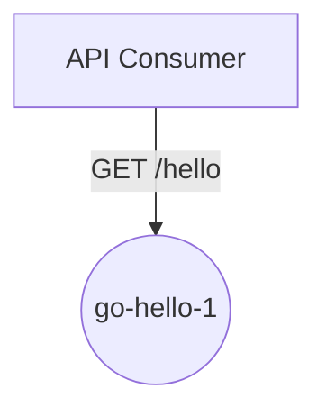
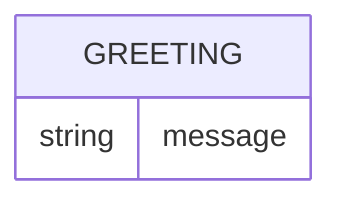
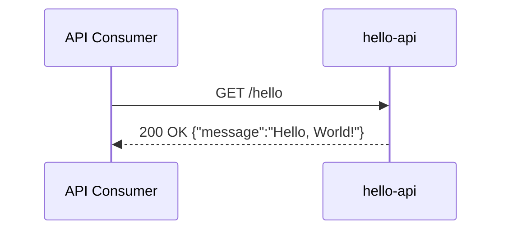

# go-hello-1 — Design

## Overview

A single, minimal Go HTTP service, `hello-api`, exposes one public endpoint —
`GET /hello` — that returns a fixed JSON greeting. There is no database, no
authentication, no external dependency, and no frontend; the entire system is
one deployable component reachable directly from the internet gateway.

## Context (C1)

## Domain model (ER)

There is no persistent data model — the service is stateless and holds no
entities. The single response is a fixed literal, not a stored record:

## Key flows

